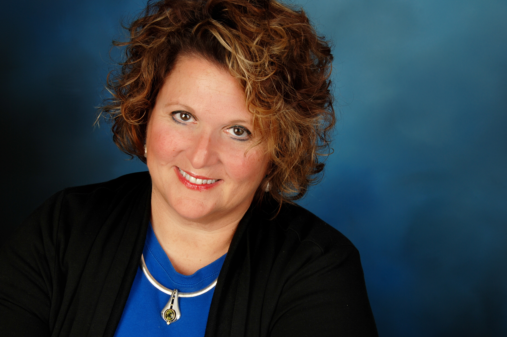

Wendy Marks is a Medical Intuitive and Rehabilitation Counselor with thirty years of practice in traditional and complementary health therapies.
[Sign Up for Wendy's Email Blog](http://visitor.r20.constantcontact.com/d.jsp?llr=ourelesab&p=oi&m=1118984881806&sit=58jkkwfjb&f=ce6451c5-4206-480f-900c-751ed3eae805)

**With significant experience in helping people improve their physical, mental and spiritual health, she provides:**
* Medical Intuitive Sessions
* Energy Healing
* Integrative Therapy
* Shamanic Studies
* Soul Retrieval
* Energy Medicine

**These services are provided to Wendy's clients locally, nationally and internationally. **

> See Wendy's article ["What is a Medical Intuitive"](articles/whatisa.html) for more information about her abilities.

Wendy has extensive knowledge in both traditional medicine and non-traditional therapies, and has used her skills to help those who couldn't find relief through traditional means alone.

> "I had terrible headaches for months. My neurologist had no idea what was wrong with me. But after just one session with Wendy, she identified the problem with my spine. I am now pain free and enjoying life again."

In addition to her work as a Medical Intuitive, Wendy is a sought-after conference speaker and columnist. Some of her speaking engagements focus on topics such as:
**
Chronic vs. Acute Illness: Western and Alternative Care Models
**
Supplements and Vitamins: The New Drugs, Uses and Abuses
**
Psychic Abilities and Spirituality
**
Developing Your Intuition

To compliment her knowledge of non-traditional health therapies, Wendy has a broad range of expertise with traditional medicine. She holds a post master's degree in Rehabilitation Counseling, and a C.S.S. degree from Harvard. She is a Fellow of the American Psychotherapy Association, a member of the Association for Comprehensive Energy Psychology, and a Diplomate of the American Association of Integrative Medicine.

Please note that Wendy Marks does not diagnose medical conditions or prescribe medicine. She is a partner in health with her clients to help them achieve a happy and healthy life.